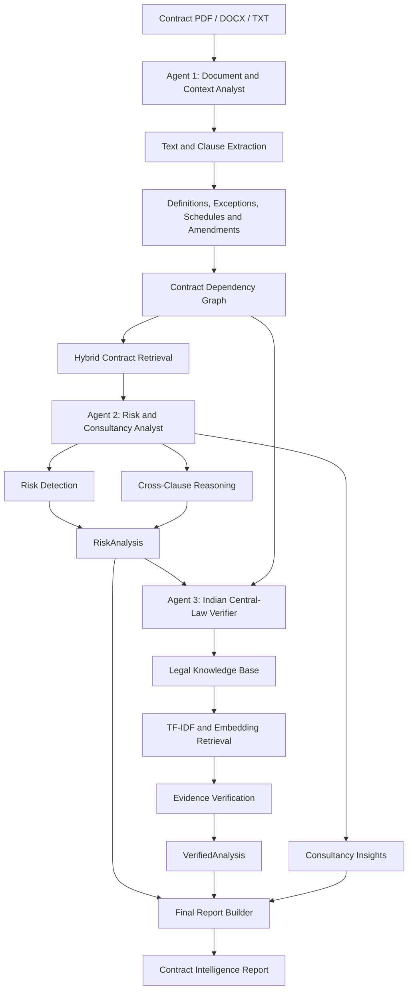

# Legal Contract Analyzer

> An AI-powered legal contract analysis system that identifies potential contractual risks, traces hidden dependencies between clauses, verifies findings against relevant Indian Central Law, and provides clear, consultancy-style explanations to help users understand what deserves attention before signing.

## Team

**Team Name:** CoolBerg Testers

| Member | Contribution |
|---|---|
| Himanshu | System architecture, agent orchestration, shared schemas, and pipeline integration |
| Vanshika | Agent 1 — document processing, clause extraction, dependency graph, TF-IDF, and embeddings |
| Nandana | Agent 2 — contract risk analysis, cross-clause reasoning, consultancy insights, and risk scoring |
| Varun | Agent 3 — Indian Central-Law knowledge base, legal retrieval, source verification, and evidence grounding |

## Problem Statement

### The Problem

Legal contracts are often lengthy, complex, and written in language that is difficult for non-lawyers to understand. Individuals and businesses regularly sign employment agreements, rental agreements, NDAs, service contracts, and other legal documents without fully understanding their obligations, liabilities, restrictions, or potential financial consequences.

Understanding a contract may require professional legal assistance, which can involve additional cost, time, and effort. Users may also struggle to identify which clauses require closer attention or which questions they should ask a lawyer before signing.

The challenge becomes more complex because **legal clauses rarely operate independently**.

A clause may depend on definitions, exceptions, conditions, schedules, annexures, amendments, or other provisions located elsewhere in the document. For example, a termination clause may appear straightforward until a renewal provision, an exception, or a later amendment changes its practical effect.

Conventional document summarization and basic retrieval-based AI systems may overlook these long-range dependencies when analyzing individual passages in isolation.

The problem is therefore not just understanding the words in a contract. It is understanding how its provisions interact, what risks those interactions may create, and whether legal claims are supported by reliable evidence.

### Why We Chose This Problem

We chose this problem because contracts influence important financial, professional, and personal decisions, yet understanding their implications can be difficult without legal expertise.

We want to make contract understanding more accessible by building a system that helps users identify potentially problematic provisions, understand their practical implications, and prepare informed questions for a qualified legal professional.

Our focus is on combining document intelligence, dependency-aware reasoning, legal-source verification, and consultancy-style explanations rather than building another general-purpose document summarizer.

## Solution

Legal Contract Analyzer is an AI-powered contract intelligence system initially focused on contracts involving Indian Central Law.

The system processes a document through three specialized agents:

1. **Document & Context Analyst:** Extracts the contract's structure and identifies relationships between clauses, definitions, exceptions, schedules, and amendments.
2. **Contract Risk & Consultancy Analyst:** Evaluates potential contractual risks, reasons across connected provisions, and explains practical consequences.
3. **India Central-Law Verification Agent:** Checks findings against the original contract and retrieves relevant authoritative legal material to determine what is supported, uncertain, or requires professional review.

The output is a structured report containing plain-language explanations, potentially significant risks, relevant clause references, legal context, and questions users can discuss with a lawyer.

The system is intended to support legal understanding and professional review, not replace qualified legal advice or make signing decisions for users.

### Key Features

- **Document Analysis:** Extracts clauses, definitions, obligations, dates, amounts, schedules, annexures, and amendments from supported documents.
- **Risk Detection:** Identifies potential financial, termination, renewal, liability, indemnification, intellectual-property, privacy, and other contractual risks.
- **Long-Range Dependency Analysis:** Traces relationships between clauses even when relevant provisions are separated by many pages.
- **Cross-Clause Reasoning:** Identifies potential conflicts, exceptions, and combined risks that may not be apparent from individual clauses.
- **Indian Central-Law Verification:** Retrieves relevant legal provisions and authoritative sources to support or qualify findings.
- **Evidence-Grounded Results:** Links findings to the original contract text and relevant legal sources wherever available.
- **Consultancy-Style Insights:** Explains why a provision matters, its potential implications, questions to ask a lawyer, and possible points for review or negotiation.
- **Hybrid Retrieval:** Combines TF-IDF, semantic embeddings, exact-reference detection, and dependency-graph traversal.
- **Human-Review Flags:** Highlights uncertain interpretations, missing evidence, complex dependencies, and situations requiring professional assessment.

## Innovation and Differentiation

The central innovation is treating a contract as an **interconnected legal structure rather than a collection of independent text chunks**.

A basic retrieval-augmented generation (RAG) system typically retrieves passages based on similarity to a query. However, a relevant contractual exception or amendment may not be semantically similar enough to be retrieved automatically.

Legal Contract Analyzer is designed to supplement semantic retrieval with a contract dependency graph.

For example:

- Clause 5 establishes a termination notice period.
- Clause 20 introduces automatic renewal.
- Schedule B modifies termination conditions.
- Amendment 2 changes the original agreement.

The system attempts to connect these provisions before evaluating the overall risk.

A second differentiator is separating three types of information:

- **Contract evidence:** What the document actually states.
- **Legal evidence:** What the retrieved authoritative legal sources establish.
- **Analytical inference:** What the system concludes from the interaction between the contract and the available evidence.

This separation supports more transparent findings and helps prevent commercially unfavorable provisions from being incorrectly labelled illegal or unenforceable.

## Technical Implementation

### Architecture



### Technology Stack

| Category | Technologies |
|---|---|
| Frontend | N/A — initial backend-first implementation |
| Backend | Python, FastAPI |
| Data Validation | Pydantic |
| Document Processing | PyPDF or pypdf, python-docx, OCR integration if required |
| Database | To be finalized based on the implemented storage architecture |
| Vector Database | Qdrant, ChromaDB, or pgvector — final selection pending |
| AI / ML | Gemma model through a compatible API, Gemini API integration where supported, embeddings, TF-IDF |
| NLP / Retrieval | scikit-learn, semantic search, hybrid retrieval |
| Infrastructure | Python environment; Docker if implemented |
| APIs / Services | Gemini API, authoritative Indian legal-source repositories |

**Model configuration**

The planned generation settings are:

```env
MODEL_TEMPERATURE=0.2
MODEL_FREQUENCY_PENALTY=0.0
MODEL_PRESENCE_PENALTY=0.0
```

These settings should be validated against the selected model and API. Not every provider or model supports frequency and presence penalties.

### How It Works

#### Agent 1 — Document & Context Analyst

Agent 1 transforms an uploaded document into a structured representation.

Its responsibilities include:

- Extracting text while preserving page and section information.
- Identifying clauses, subclauses, and definitions.
- Detecting obligations, conditions, and exceptions.
- Identifying schedules, annexures, and amendments.
- Extracting explicit cross-references.
- Building a dependency graph connecting related provisions.
- Preparing text for lexical and semantic retrieval.

Each clause receives a stable identifier and retains its source location.

Example:

```json
{
  "clause_id": "C-050",
  "type": "termination",
  "text": "Example clause text",
  "location": {
    "page_start": 50,
    "section": "8.2"
  }
}
```

Agent 1 focuses on document structure and context rather than making legal conclusions.

#### Agent 2 — Contract Risk & Consultancy Analyst

Agent 2 analyzes the structured contract and the relevant dependency context to identify potential risks.

It evaluates areas such as:

- Financial obligations and penalties.
- Termination and automatic renewal.
- Liability and indemnification.
- Intellectual-property ownership.
- Confidentiality and data handling.
- Exclusivity and restrictive covenants.
- Arbitration and dispute resolution.
- Ambiguous or conflicting provisions.

It also identifies risks that emerge from multiple connected clauses.

For each important finding, it aims to explain what the clause says, why it matters, the potential practical consequences, the related clauses, and questions the user could discuss with a lawyer.

Risk scoring should use explainable factors and deterministic application logic where possible.

#### Agent 3 — India Central-Law Verification Agent

Agent 3 evaluates the findings from Agent 2 against the original contract and a separate legal knowledge base.

It aims to:

1. Confirm that the contract evidence supports the finding.
2. Check relevant definitions, exceptions, schedules, and amendments.
3. Retrieve applicable Indian Central-Law provisions.
4. Attach source references and supporting excerpts.
5. Distinguish supported legal claims from unsupported or uncertain claims.
6. Flag matters that require further research or professional review.

Possible verification statuses include:

- `VERIFIED`
- `PARTIALLY_SUPPORTED`
- `UNSUPPORTED`
- `CONTRADICTED`
- `LEGAL_SUPPORT_NOT_FOUND`
- `STATE_LAW_REQUIRED`
- `HUMAN_REVIEW_REQUIRED`

The agent must not invent legal citations or treat the absence of a retrieved source as proof that no relevant law exists.

### Contract Dependency Graph

The dependency graph represents relationships between contract components.

Supported relationship types may include:

```text
REFERENCES
DEFINED_BY
MODIFIED_BY
OVERRIDES
EXCEPTED_BY
LIMITED_BY
CONDITIONED_BY
INCORPORATES
RELATED_TO
```

For example:

```text
C-005
  ├── DEFINED_BY ───────> DEF-002
  ├── LIMITED_BY ───────> C-041
  ├── MODIFIED_BY ──────> SCH-003
  └── OVERRIDDEN_BY ────> AMD-002
```

The system combines explicit reference detection with semantic retrieval to assemble relevant context before risk analysis.

### TF-IDF and Embeddings

**TF-IDF** is used for lexical retrieval, keyword matching, and identifying passages that share important terminology with a query.

**Embeddings** represent text as numerical vectors, allowing the system to retrieve passages with similar meanings even when they use different words.

For example, a user asking, "Can I cancel this agreement?" may need information from a clause that uses the formal term "termination."

The two retrieval methods complement one another. Explicit cross-reference detection and dependency-graph traversal provide additional protection against missing distant but structurally relevant clauses.

### Legal Knowledge Base

The initial scope is Indian Central Law, with selected authoritative legal material organized into searchable records.

Potential sources include:

- Indian Contract Act, 1872.
- Consumer Protection Act, 2019.
- Specific Relief Act, 1963.
- Arbitration and Conciliation Act, 1996.
- Sale of Goods Act, 1930.
- Information Technology Act, 2000.
- Digital Personal Data Protection Act, 2023, subject to commencement and applicable provisions.
- Copyright Act, 1957.
- Patents Act, 1970.
- Trade Marks Act, 1999.
- Companies Act, 2013.
- Competition Act, 2002.
- Limitation Act, 1963.
- Insolvency and Bankruptcy Code, 2016.
- Selected relevant Supreme Court judgments.

This list defines potential coverage, not a claim that every Act or judgment has already been ingested or verified.

Legal records should preserve the document title, section, source URL, relevant dates, and authority so retrieved information can be checked against the original source.

### Technical Decisions

1. **Three specialized agents:** Separate document understanding, risk analysis, and legal verification to establish clear responsibilities and reduce output conflicts.
2. **Dependency-aware retrieval:** Trace explicit references and related provisions rather than relying exclusively on semantic similarity.
3. **Hybrid search:** Combine TF-IDF, embeddings, exact-reference detection, and graph traversal.
4. **Structured outputs:** Use Pydantic models to validate `DocumentAnalysis`, `RiskAnalysis`, and `VerifiedAnalysis` before passing results between agents.
5. **Evidence grounding:** Link important claims to source clauses and retrieved legal material.
6. **Deterministic aggregation:** Use application code for stable IDs, schema validation, evidence linking, and final report assembly.
7. **Modular model integration:** Keep the model client replaceable so the application can adapt to compatible hosted or local models.

## Implementation During the Hackathon

The intended minimum viable product focuses on a working end-to-end pipeline rather than a frontend-heavy application.

The implementation targets are:

- Contract text extraction and structured clause representation.
- Cross-reference detection and dependency graph creation.
- Contract risk identification and cross-clause reasoning.
- Hybrid lexical and semantic retrieval.
- A legal knowledge base containing a selected subset of authoritative Indian legal sources.
- Verification of findings against available evidence.
- A structured report with plain-language explanations and questions for professional review.
- Integration tests that validate communication between all three agents.

**Final implementation status:** To be updated after the actual features and tests have been completed.

### Team Contributions

- **Himanshu:** System architecture, agent orchestration, shared interfaces, and integration.
- **Vanshika:** Agent 1 — document extraction, clause parsing, dependency mapping, and contract retrieval.
- **Nandana:** Agent 2 — risk analysis, cross-clause reasoning, consultancy insights, and risk prioritization.
- **Varun:** Agent 3 — legal knowledge-base ingestion, legal retrieval, source verification, and evidence grounding.

## Working Application

**Live Application:** TBD

The project is initially designed as a backend-first system. A working API or compatible agent/tool interface can allow the pipeline to be integrated into a future frontend or host application.

Once deployed, this section should include the actual application URL and explain which document formats and analysis features are available for testing.

## Demo Video

**Demo Video:** TBD

The demonstration should cover:

1. Providing a sample contract.
2. Extracting clauses and definitions.
3. Showing dependencies between distant provisions.
4. Identifying a potential risk arising from multiple clauses.
5. Retrieving relevant Indian legal evidence.
6. Producing the final report with evidence, explanations, and questions for a lawyer.

A particularly effective demonstration would use a sample contract in which a termination provision is modified by a separate schedule or amendment.

## Open Source and AI Usage

### AI / Models

- **Gemma:** Intended for structured document analysis, risk reasoning, and consultancy-style explanations, subject to the availability of a compatible model and API.
- **Gemini API:** Intended as the model integration layer where the selected model is supported by the API.
- **Embeddings model:** Used for semantic search over contract clauses and legal records.
- **TF-IDF:** Used for lexical retrieval and keyword-level matching.

The exact model identifiers and API capabilities must match the implementation. Gemini API access to Gemini models should not be assumed to imply access to every Gemma model.

### Open Source Components

- **Python:** Core implementation language.
- **FastAPI:** API framework, if used in the final backend.
- **Pydantic:** Schema validation and structured agent communication.
- **pypdf:** PDF text extraction.
- **python-docx:** DOCX document processing.
- **scikit-learn:** TF-IDF and classical text retrieval.
- **Qdrant, ChromaDB, or pgvector:** Potential vector-store implementations; document the one actually selected.
- **India Code:** Potential source for authoritative Central legislation.
- **Supreme Court of India official resources:** Potential source for selected judgments.

The final submission should record the exact packages, model identifiers, legal sources, versions, licenses, and applicable attribution requirements actually used.

## Setup and Usage

### Prerequisites

- Python 3.11 or a compatible version specified by the project.
- Git.
- An API key for the selected hosted model, if applicable.
- The configured vector database, if required by the implementation.
- Access to the legal-source files or configured retrieval service.

### Installation

```bash
git clone <repository-url>
cd <project-directory>

python -m venv .venv
```

Activate the virtual environment.

Linux/macOS:

```bash
source .venv/bin/activate
```

Windows:

```powershell
.venv\Scripts\Activate.ps1
```

Install dependencies:

```bash
pip install -r requirements.txt
```

### Environment Variables

Create a local `.env` file based on `.env.example`.

```env
GEMINI_API_KEY=your_api_key_here

MODEL_NAME=your_supported_model_id
MODEL_TEMPERATURE=0.2
MODEL_FREQUENCY_PENALTY=0.0
MODEL_PRESENCE_PENALTY=0.0

EMBEDDING_MODEL=your_embedding_model_id

VECTOR_DB_URL=your_vector_database_url
VECTOR_DB_COLLECTION=contract-risk

LEGAL_DATA_DIR=./data/legal_knowledge
```

Replace the placeholders with actual supported values. Only configure variables required by the implemented components.

**Security:** Never commit `.env`, API keys, credentials, or private user contracts to GitHub.

### Running the Project

The intended command, once implemented, is:

```bash
python -m pipeline.orchestrator --file path/to/contract.pdf
```

The expected pipeline outputs are:

```text
DocumentAnalysis
RiskAnalysis
VerifiedAnalysis
FinalContractReport
```

Use the actual command exposed by the repository if it differs from this planned interface.

### Usage

1. Provide a supported legal contract.
2. Allow Agent 1 to extract clauses and identify dependencies.
3. Let Agent 2 analyze potential risks using the relevant contractual context.
4. Let Agent 3 verify findings against the original document and available legal sources.
5. Review the generated report, supporting evidence, uncertainty flags, and questions for professional review.

## Devpost Submission

**Devpost Project:** TBD

The final Devpost page should contain the project description, problem statement, technical innovation, architecture, technology stack, team details, repository link, working application link where applicable, and demo video.

## Credits and License

### Credits

We acknowledge the developers and maintainers of the libraries, models, APIs, and data sources used in the final implementation, including any applicable Google AI resources, Python packages, official Indian legal repositories, and selected judicial sources.

Exact versions, licenses, source links, and required attribution should be documented before submission.

### License

**To be decided by the team.**

The team may consider an open-source license such as MIT for original project code, subject to compatibility with third-party licenses and any restrictions on external data or legal materials.

## Challenges and Learnings

### Challenges

- Maintaining relevant context across long contracts.
- Resolving definitions, exceptions, schedules, and amendments.
- Detecting contradictions between distant clauses.
- Managing limited model context windows.
- Reducing hallucinations in a high-stakes domain.
- Distinguishing commercial risk from legal invalidity.
- Ensuring reliable retrieval and source attribution.
- Maintaining consistent output schemas across independently developed agents.

### Learnings

The project demonstrates that effective contract analysis requires more than document summarization. It combines structured document extraction, dependency-aware retrieval, lexical and semantic search, evidence verification, and deterministic validation.

The central technical insight is that contractual meaning is often relational: a clause may only be understood correctly when its surrounding definitions, exceptions, and modifications are considered.

## Submission Checklist

- [x] Project title and description drafted
- [x] Team name and members listed
- [x] Problem statement documented
- [x] Reason for choosing the problem explained
- [x] Solution and key features documented
- [x] Innovation and differentiation explained
- [x] Architecture diagram included
- [x] Technical implementation and agent roles documented
- [x] Consultancy component documented
- [x] Indian Central-Law scope documented
- [x] TF-IDF and embeddings explained
- [ ] Final model and API identifiers verified
- [ ] Actual technology choices confirmed
- [ ] Full implementation completed
- [ ] Legal knowledge base populated and checked
- [ ] Integration tests passing
- [ ] Setup instructions tested on a clean machine
- [ ] Working application verified
- [ ] Live application URL added, if applicable
- [ ] Demo video recorded and linked
- [ ] Repository URL added
- [ ] Devpost submission completed and linked
- [ ] Actual package and data-source licenses checked
- [ ] External-source attribution completed
- [ ] Security review completed
- [ ] Final implementation status updated
- [ ] Challenges and learnings updated based on actual work
